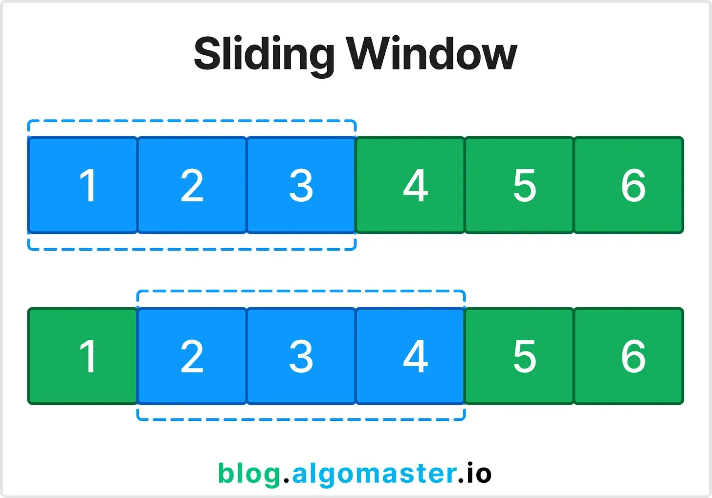
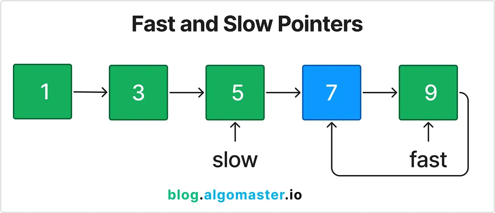
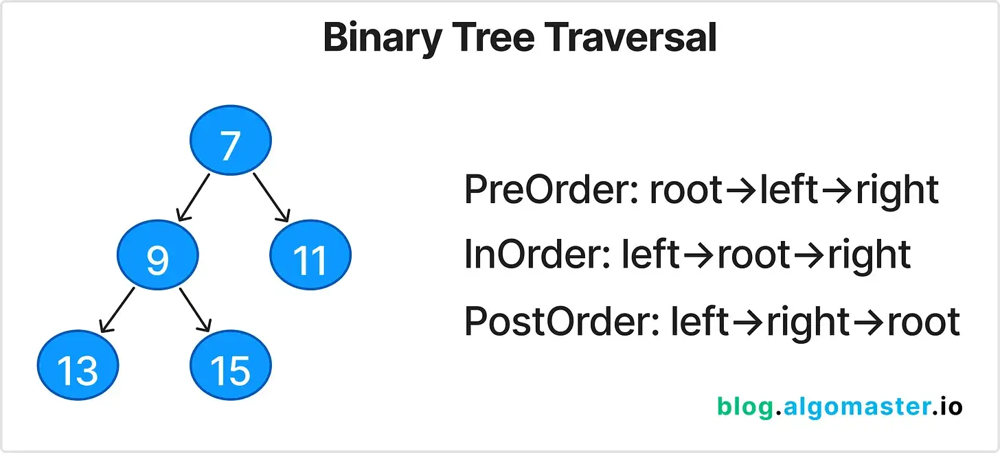
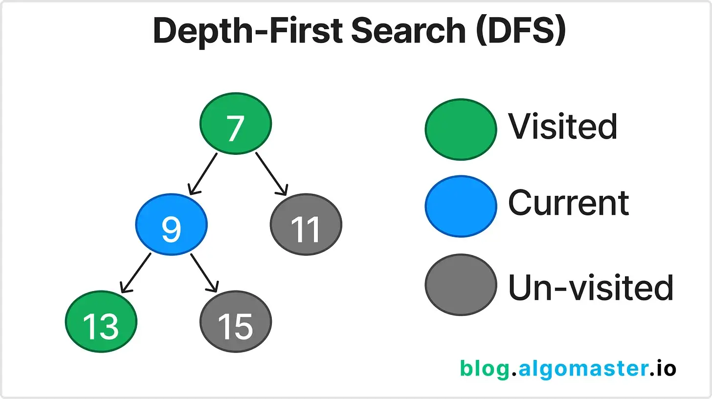
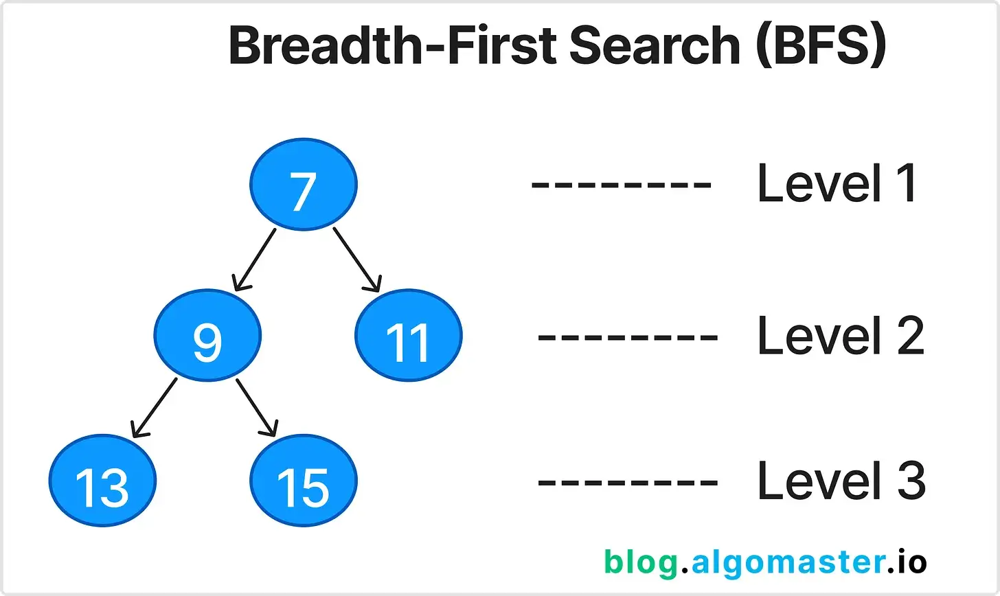
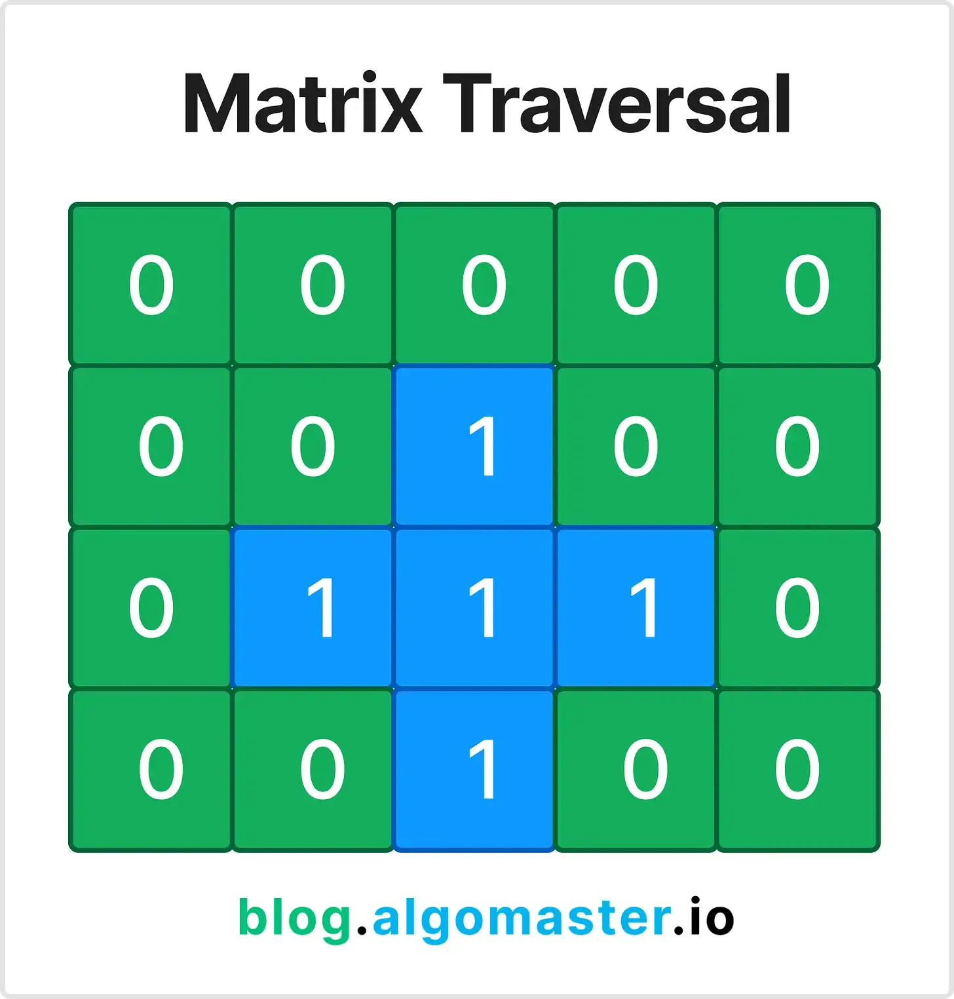

1. **Prefix Sum**

Prefix Sum involves preprocessing an array to create a new array where each element at index i represents the sum of the array from the start up to i. This allows for efficient sum queries on subarrays.

Use this pattern when you need to perform multiple sum queries on a subarray or need to calculate cumulative sums.

Sample Problem:
Given an array nums, answer multiple queries about the sum of elements within a specific range [i, j].

*Example:*

Input: nums = [1, 2, 3, 4, 5, 6], i = 1, j = 3

Output: 9

Explanation:
Preprocess the array A to create a prefix sum array: P = [1, 3, 6, 10, 15, 21].

To find the sum between indices i and j, use the formula: P[j] - P[i-1].

*LeetCode Problems:*

[Range Sum Query - Immutable (LeetCode #303)](https://leetcode.com/problems/range-sum-query-immutable/description/)

[Contiguous Array (LeetCode #525)](https://leetcode.com/problems/contiguous-array/description/)

[Subarray Sum Equals K (LeetCode #560)](https://leetcode.com/problems/subarray-sum-equals-k/description/)

2. **Two Pointers**

The Two Pointers pattern involves using two pointers to iterate through an array or list, often used to find pairs or elements that meet specific criteria.

Use this pattern when dealing with sorted arrays or lists where you need to find pairs that satisfy a specific condition.

Sample Problem:
Find two numbers in a sorted array that add up to a target value.

*Example:*

Input: nums = [1, 2, 3, 4, 6], target = 6

Output: [1, 3]

Explanation:
Initialize two pointers, one at the start (left) and one at the end (right) of the array.

Check the sum of the elements at the two pointers.

If the sum equals the target, return the indices.

If the sum is less than the target, move the left pointer to the right.

If the sum is greater than the target, move the right pointer to the left.

*LeetCode Problems:*

[Two Sum II - Input Array is Sorted (LeetCode #167)](https://leetcode.com/problems/two-sum-ii-input-array-is-sorted/description/)

[3Sum (LeetCode #15)](https://leetcode.com/problems/3sum/description/)

[Container With Most Water (LeetCode #11)](https://leetcode.com/problems/container-with-most-water/description/)

3. **Sliding Window**

The Sliding Window pattern is used to find a subarray or substring that satisfies a specific condition, optimizing the time complexity by maintaining a window of elements.

Use this pattern when dealing with problems involving contiguous subarrays or substrings.

Sample Problem:
Find the maximum sum of a subarray of size k.

*Example:*

Input: nums = [2, 1, 5, 1, 3, 2], k = 3

Output: 9

Explanation:
Start with the sum of the first k elements.

Slide the window one element at a time, subtracting the element that goes out of the window and adding the new element.

Keep track of the maximum sum encountered.

*LeetCode Problems:*

[Maximum Average Subarray I (LeetCode #643)](https://leetcode.com/problems/maximum-average-subarray-i/description/)

[Longest Substring Without Repeating Characters (LeetCode #3)](https://leetcode.com/problems/longest-substring-without-repeating-characters/description/)

[Minimum Window Substring (LeetCode #76)](https://leetcode.com/problems/minimum-window-substring/description/)

4. **Fast & Slow Pointers**

The Fast & Slow Pointers (Tortoise and Hare) pattern is used to detect cycles in linked lists and other similar structures.

Sample Problem:
Detect if a linked list has a cycle.

Explanation:
Initialize two pointers, one moving one step at a time (slow) and the other moving two steps at a time (fast).

If there is a cycle, the fast pointer will eventually meet the slow pointer.

If the fast pointer reaches the end of the list, there is no cycle.

*LeetCode Problems:*

[Linked List Cycle (LeetCode #141)](https://leetcode.com/problems/linked-list-cycle/description/)

[Happy Number (LeetCode #202)](https://leetcode.com/problems/happy-number/description/)

[Find the Duplicate Number (LeetCode #287)](https://leetcode.com/problems/find-the-duplicate-number/description/)

5. **LinkedList In-place Reversal**

The In-place Reversal of a LinkedList pattern reverses parts of a linked list without using extra space.

Use this pattern when you need to reverse sections of a linked list.

Sample Problem:
Reverse a sublist of a linked list from position m to n.

*Example:*

Input: head = [1, 2, 3, 4, 5], m = 2, n = 4

Output: [1, 4, 3, 2, 5]

Explanation:
Identify the start and end of the sublist.

Reverse the nodes in place by adjusting the pointers.

*LeetCode Problems:*

[Reverse Linked List (LeetCode #206)](https://leetcode.com/problems/reverse-linked-list/description/)

[Reverse Linked List II (LeetCode #92)](https://leetcode.com/problems/reverse-linked-list-ii/description/)

[Swap Nodes in Pairs (LeetCode #24)](https://leetcode.com/problems/swap-nodes-in-pairs/description/)

6. **Monotonic Stack**

The Monotonic Stack pattern uses a stack to maintain a sequence of elements in a specific order (increasing or decreasing).

Use this pattern for problems that require finding the next greater or smaller element.

Sample Problem:
Find the next greater element for each element in an array. Output -1 if the greater element doesn’t exist.

*Example:*

Input: nums = [2, 1, 2, 4, 3]

Output: [4, 2, 4, -1, -1]

Explanation:
Use a stack to keep track of elements for which we haven't found the next greater element yet.

Iterate through the array, and for each element, pop elements from the stack until you find a greater element.

If the stack is not empty, set the result for index at the top of the stack to current element.

Push the current element onto the stack.

*LeetCode Problems:*

[Next Greater Element I (LeetCode #496)](https://leetcode.com/problems/next-greater-element-i/description/)

[Daily Temperatures (LeetCode #739)](https://leetcode.com/problems/daily-temperatures/description/)

[Largest Rectangle in Histogram (LeetCode #84)](https://leetcode.com/problems/largest-rectangle-in-histogram/description/)

7. **Top ‘K’ Elements**

The Top 'K' Elements pattern finds the top k largest or smallest elements in an array or stream of data using heaps or sorting.

Sample Problem:
Find the k-th largest element in an unsorted array.

*Example:*

Input: nums = [3, 2, 1, 5, 6, 4], k = 2

Output: 5

Explanation:
Use a min-heap of size k to keep track of the k largest elements.

Iterate through the array, adding elements to the heap.

If the heap size exceeds k, remove the smallest element from the heap.

The root of the heap will be the k-th largest element.

*LeetCode Problems:*

[Kth Largest Element in an Array (LeetCode #215)](https://leetcode.com/problems/kth-largest-element-in-an-array/description/)

[Top K Frequent Elements (LeetCode #347)](https://leetcode.com/problems/top-k-frequent-elements/description/)

[Find K Pairs with Smallest Sums (LeetCode #373)](https://leetcode.com/problems/find-k-pairs-with-smallest-sums/description/)

8. **Overlapping Intervals**

The Overlapping Intervals pattern is used to merge or handle overlapping intervals in an array.

In an interval array sorted by start time, two intervals [a, b] and [c, d] overlap if b >= c (i.e., the end time of the first interval is greater than or equal to the start time of the second interval).

Sample Problem:
Problem Statement: Merge all overlapping intervals.

*Example:*

Input: intervals = [[1, 3], [2, 6], [8, 10], [15, 18]]

Output: [[1, 6], [8, 10], [15, 18]]

Explanation:
Sort the intervals by their start time.

Create an empty list called merged to store the merged intervals.

Iterate through the intervals and check if it overlaps with the last interval in the merged list.

If it overlaps, merge the intervals by updating the end time of the last interval in merged.

If it does not overlap, simply add the current interval to the merged list.

*LeetCode Problems:*

[Merge Intervals (LeetCode #56)](https://leetcode.com/problems/merge-intervals/description/)

[Insert Interval (LeetCode #57)](https://leetcode.com/problems/insert-interval/description/)

[Non-Overlapping Intervals (LeetCode #435)](https://leetcode.com/problems/non-overlapping-intervals/description/)

9. **Modified Binary Search**

The Modified Binary Search pattern adapts binary search to solve a wider range of problems, such as finding elements in rotated sorted arrays.

Use this pattern for problems involving sorted or rotated arrays where you need to find a specific element.

Sample Problem:
Find an element in a rotated sorted array.

*Example:*

Input: nums = [4, 5, 6, 7, 0, 1, 2], target = 0

Output: 4

Explanation:
Perform binary search with an additional check to determine which half of the array is sorted.

We then check if the target is within the range of the sorted half.

If it is, we search that half; otherwise, we search the other half.

*LeetCode Problems:*

[Search in Rotated Sorted Array (LeetCode #33)](https://leetcode.com/problems/search-in-rotated-sorted-array/description/)

[Find Minimum in Rotated Sorted Array (LeetCode #153)](https://leetcode.com/problems/find-minimum-in-rotated-sorted-array/description/)

[Search a 2D Matrix II (LeetCode #240)](https://leetcode.com/problems/search-a-2d-matrix-ii/description/)

10. **Binary Tree Traversal**

Binary Tree Traversal involves visiting all the nodes in a binary tree in a specific order.

PreOrder: root -> left -> right

InOrder: left -> root -> right

PostOrder: left -> right -> root

Sample Problem:
Problem Statement: Perform inorder traversal of a binary tree.

*Example:*

Input: root = [1, null, 2, 3]

Output: [1, 3, 2]

Explanation:
Inorder traversal visits nodes in the order: left, root, right.

Use recursion or a stack to traverse the tree in this order.

*LeetCode Problems:*

[PreOrder → Binary Tree Paths (LeetCode #257)](https://leetcode.com/problems/binary-tree-paths/description/)

[InOrder → Kth Smallest Element in a BST (LeetCode #230)](https://leetcode.com/problems/kth-smallest-element-in-a-bst/description/)

[PostOrder → Binary Tree Maximum Path Sum (LeetCode #124)](https://leetcode.com/problems/binary-tree-maximum-path-sum/description/)

11. **Depth-First Search (DFS)**

Depth-First Search (DFS) is a traversal technique that explores as far down a branch as possible before backtracking.

Use this pattern for exploring all paths or branches in graphs or trees.

Sample Problem:
Find all paths from the root to leaves in a binary tree.

*Example:*

Input: root = [1, 2, 3, null, 5]

Output: ["1->2->5", "1->3"]

Explanation:
Use recursion or a stack to traverse each path from the root to the leaves.

Record each path as you traverse.

*LeetCode Problems:*

[Clone Graph (LeetCode #133)](https://leetcode.com/problems/clone-graph/description/)

[Path Sum II (LeetCode #113)](https://leetcode.com/problems/path-sum-ii/description/)

[Course Schedule II (LeetCode #210)](https://leetcode.com/problems/course-schedule-ii/description/)

12. **Breadth-First Search (BFS)**

Breadth-First Search (BFS) is a traversal technique that explores nodes level by level in a tree or graph.

Use this pattern for finding the shortest paths in unweighted graphs or level-order traversal in trees.

Sample Problem:
Perform level-order traversal of a binary tree.

*Example:*

Input: root = [3, 9, 20, null, null, 15, 7]

Output: [[3], [9, 20], [15, 7]]

Explanation:
Use a queue to keep track of nodes at each level.

Traverse each level and add the children of the current nodes to the queue.

*LeetCode Problems:*

[Binary Tree Level Order Traversal (LeetCode #102)](https://leetcode.com/problems/binary-tree-level-order-traversal/description/)

[Rotting Oranges (LeetCode #994)](https://leetcode.com/problems/rotting-oranges/description/)

[Word Ladder (LeetCode #127)](https://leetcode.com/problems/word-ladder/description/)

13. **Matrix Traversal**

Matrix Traversal involves traversing elements in a matrix using different techniques (DFS, BFS, etc.).

Use this pattern for problems involving traversing 2D grids or matrices horizontally, vertically or diagonally.

Sample Problem:
Perform flood fill on a 2D grid. Change all the cells connected to the starting cell to new color.

*Example:*

Input: image = [[1,1,1],[1,1,0],[1,0,1]], sr = 1, sc = 1, newColor = 2

Output: [[2,2,2],[2,2,0],[2,0,1]]

Explanation:
Use DFS or BFS to traverse the matrix starting from the given cell.

Change the color of the connected cells to the new color.

*LeetCode Problems:*

[Flood Fill (LeetCode #733)](https://leetcode.com/problems/flood-fill/description/)

[Number of Islands (LeetCode #200)](https://leetcode.com/problems/number-of-islands/description/)

[Surrounded Regions (LeetCode #130)](https://leetcode.com/problems/surrounded-regions/description/)

14. **Backtracking**

Backtracking explores all possible solutions and backtracks when a solution path fails.

Use this pattern when you need to find all (or some) solutions to a problem that satisfies given constraints. For *example:* combinatorial problems, such as generating permutations, combinations, or subsets.

Sample Problem:
Generate all permutations of a given list of numbers.

*Example:*

Input: nums = [1, 2, 3]

Output: [[1,2,3], [1,3,2], [2,1,3], [2,3,1], [3,1,2], [3,2,1]]

Explanation:
Use recursion to generate permutations.

For each element, include it in the current permutation and recursively generate the remaining permutations.

Backtrack when all permutations for a given path are generated.

*LeetCode Problems:*

[Permutations (LeetCode #46)](https://leetcode.com/problems/permutations/description/)

[Subsets (LeetCode #78)](https://leetcode.com/problems/subsets/description/)

[N-Queens (LeetCode #51)](https://leetcode.com/problems/n-queens/description/)

15. **Dynamic Programming Patterns**

Dynamic Programming (DP) involves breaking down problems into smaller subproblems and solving them using a bottom-up or top-down approach.

Use this pattern for problems with overlapping subproblems and optimal substructure.

DP itself has multiple sub-patterns. Some of the most important ones are:

Fibonacci Numbers

0/1 Knapsack

Longest Common Subsequence (LCS)

Longest Increasing Subsequence (LIS)

Subset Sum

Matrix Chain Multiplication

For more Dynamic Programming Patterns, checkout my other article:

20 Patterns to Master Dynamic Programming
20 Patterns to Master Dynamic Programming
Ashish Pratap Singh
·
28 Jul
Read full story
Sample Problem:
Calculate the n-th Fibonacci number.

*Example:*

Input: n = 5

Output: 5 (The first five Fibonacci numbers are 0, 1, 1, 2, 3, 5)

Explanation:
Use a bottom-up approach to calculate the n-th Fibonacci number.

Start with the first two numbers (0 and 1) and iterate to calculate the next numbers like (dp[i] = dp[i - 1] + dp[i - 2]).

*LeetCode Problems:*

[Climbing Stairs (LeetCode #70)](https://leetcode.com/problems/climbing-stairs/description/)

[House Robber (LeetCode #198)](https://leetcode.com/problems/house-robber/description/)

[Coin Change (LeetCode #322)](https://leetcode.com/problems/coin-change/description/)

[Longest Common Subsequence (LCS) (LeetCode #1143)](https://leetcode.com/problems/longest-common-subsequence/description/)

[Longest Increasing Subsequence (LIS) (LeetCode #322)](https://leetcode.com/problems/longest-increasing-subsequence/description/)

[Partition Equal Subset Sum (LeetCode #416)](https://leetcode.com/problems/partition-equal-subset-sum/description/)