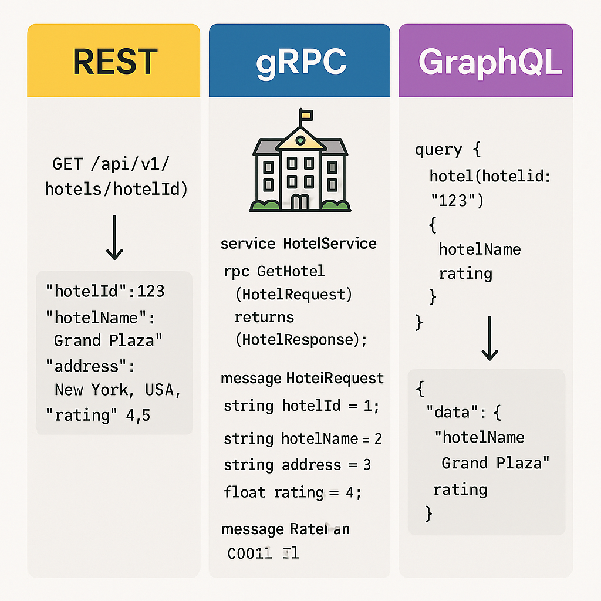

Here’s a **brief, clean** difference:

---

| Feature       | REST                        | gRPC                       | GraphQL                   |
|---------------|------------------------------|-----------------------------|----------------------------|
| Protocol      | HTTP/1.1                     | HTTP/2                     | HTTP (POST/GET)            |
| Data Format   | JSON                         | Protobuf (binary)           | JSON                      |
| Endpoint Style| Many endpoints               | Service + Method call       | Single endpoint (`/query`) |
| Flexibility   | Fixed response per endpoint  | Fixed request/response      | Client picks what it needs |
| Speed         | Moderate (text)              | Very fast (binary)          | Fast (small queries)       |
| Best For      | Public APIs, simple CRUD     | Microservices, high-speed S2S | Complex flexible APIs (mobile/web) |

---

### ✅ When to Use:

- **REST**:  
  - Public APIs
  - Simple systems
  - Browser-friendly, human-readable

- **gRPC**:  
  - Microservices needing **speed**, **low latency**
  - Internal service-to-service calls
  - Strongly typed strict contracts

- **GraphQL**:  
  - Mobile/web apps needing **flexible** and **custom data fetching**
  - Reduce over-fetching/under-fetching
  - Complex nested data (e.g., e-commerce product → reviews → user)

---

### 🎯 In one line:
- Use **REST** for simplicity.  
- Use **gRPC** for **performance**.  
- Use **GraphQL** for **flexibility**.

---

### Example

Perfect!  
Let’s see the **same `HotelService` example** implemented in **REST**, **gRPC**, and **GraphQL** styles:

---

## 🏨 Scenario:
**Get details of a Hotel** (hotelId → hotelName, address, rating)

---

### 1️⃣ **REST API**

**Endpoint:**  
```
GET /api/v1/hotels/{hotelId}
```

**Response (JSON):**
```json
{
  "hotelId": "123",
  "hotelName": "Grand Plaza",
  "address": "New York, USA",
  "rating": 4.5
}
```

- **Fixed fields**, one endpoint.
- Over-fetch or under-fetch risk if client needs only `hotelName`.
- Simple, easy for browsers and Postman.

---

### 2️⃣ **gRPC Service**

**Proto File (`hotel.proto`):**
```proto
syntax = "proto3";

service HotelService {
  rpc GetHotel (HotelRequest) returns (HotelResponse);
}

message HotelRequest {
  string hotelId = 1;
}

message HotelResponse {
  string hotelId = 1;
  string hotelName = 2;
  string address = 3;
  float rating = 4;
}
```

- **Very fast**, binary communication.
- Requires client code (stub) generation.
- Strong typing, but less flexible.

---

### 3️⃣ **GraphQL Query**

**Schema:**
```graphql
type Query {
  hotel(hotelId: String!): Hotel
}

type Hotel {
  hotelId: String!
  hotelName: String!
  address: String!
  rating: Float!
}
```

**Client Query Example:**
```graphql
query {
  hotel(hotelId: "123") {
    hotelName
    rating
  }
}
```

**Response:**
```json
{
  "data": {
    "hotel": {
      "hotelName": "Grand Plaza",
      "rating": 4.5
    }
  }
}
```

- **Client controls** what fields they want.
- One endpoint handles everything.
- Best for frontend-heavy applications.

---

## 🧠 Quick Summary:
| API Type  | When to Prefer         |
|-----------|-------------------------|
| REST      | Easy public APIs, simple clients |
| gRPC      | Internal services, need speed, real-time systems |
| GraphQL   | Frontend/mobile apps needing flexible, fast-changing data |

---

Here’s a **detailed** explanation with **real sample requests and responses**:

---

# 🆚 REST vs gRPC vs GraphQL — Detailed Comparison

| Feature         | REST                          | gRPC                              | GraphQL                           |
|-----------------|-------------------------------|-----------------------------------|-----------------------------------|
| Transport       | HTTP/1.1                      | HTTP/2 (streaming supported)      | HTTP/1.1 or HTTP/2                |
| Message Format  | JSON                          | Protobuf (compact binary)         | JSON                              |
| API Design      | Multiple Endpoints            | Single Service with RPC Methods  | Single Endpoint (`/graphql`)      |
| Flexibility     | Fixed payload                 | Fixed payload                    | Dynamic query, client chooses     |
| Speed           | Good                          | Very Fast (binary, streaming)     | Good (depends on query complexity)|
| Use Cases       | Public APIs, simple services  | Internal services, microservices  | Mobile/web apps needing flexibility |
| Browser Support | Native                        | No (needs special gateway)        | Native                            |
| Versioning      | New URL (ex: `/v1/`, `/v2/`)  | Evolve protobuf carefully         | No versioning, schema evolves easily |

---

# 📦 **Example: Get Hotel Data**

---
## 1️⃣ REST

**Request:**
```http
GET /api/v1/hotels/123
Host: example.com
```

**Response (JSON):**
```json
{
  "hotelId": "123",
  "hotelName": "Grand Plaza",
  "address": "New York, USA",
  "rating": 4.5
}
```

✅ **Simple**, human-readable  
❌ **Fixed response** — client gets all fields even if it needs only hotelName.

---

## 2️⃣ gRPC

**Proto File (`hotel.proto`):**
```proto
syntax = "proto3";

service HotelService {
  rpc GetHotel (HotelRequest) returns (HotelResponse);
}

message HotelRequest {
  string hotelId = 1;
}

message HotelResponse {
  string hotelId = 1;
  string hotelName = 2;
  string address = 3;
  float rating = 4;
}
```

**gRPC Request (binary under the hood):**
- Call `GetHotel` with `hotelId = "123"`

**Response:**
- HotelResponse (binary decoded as):
```json
{
  "hotelId": "123",
  "hotelName": "Grand Plaza",
  "address": "New York, USA",
  "rating": 4.5
}
```

✅ **Super fast**, compact  
❌ Needs **protobuf client** to make requests (cannot hit from browser/Postman directly).

---

## 3️⃣ GraphQL

**Schema:**
```graphql
type Query {
  hotel(hotelId: String!): Hotel
}

type Hotel {
  hotelId: String!
  hotelName: String!
  address: String!
  rating: Float!
}
```

**GraphQL Query:**
```graphql
query {
  hotel(hotelId: "123") {
    hotelName
    rating
  }
}
```

**Response:**
```json
{
  "data": {
    "hotel": {
      "hotelName": "Grand Plaza",
      "rating": 4.5
    }
  }
}
```

✅ **Client asks only for hotelName and rating**, nothing more  
❌ If schema becomes complex, debugging query structure can be tricky.

---

# 🎯 **Quick Real-world Mapping**

| Situation                         | Best Choice         | Why                            |
|-----------------------------------|----------------------|--------------------------------|
| Public APIs (like payment gateway)| REST                 | Easy to use, cacheable         |
| Microservices inside company      | gRPC                 | Speed, streaming, binary data  |
| Mobile app needing light fast data| GraphQL              | Fetch only needed fields       |

---

# 🔥 In super short:
- **REST** = Simplicity, no learning curve.
- **gRPC** = Speed and internal efficiency.
- **GraphQL** = Flexibility for client developers.

---

Would you also like me to show **multi-fetch** examples (where GraphQL shines the most)? 🚀 (ex: get `hotel + reviews + location` in one call!)

