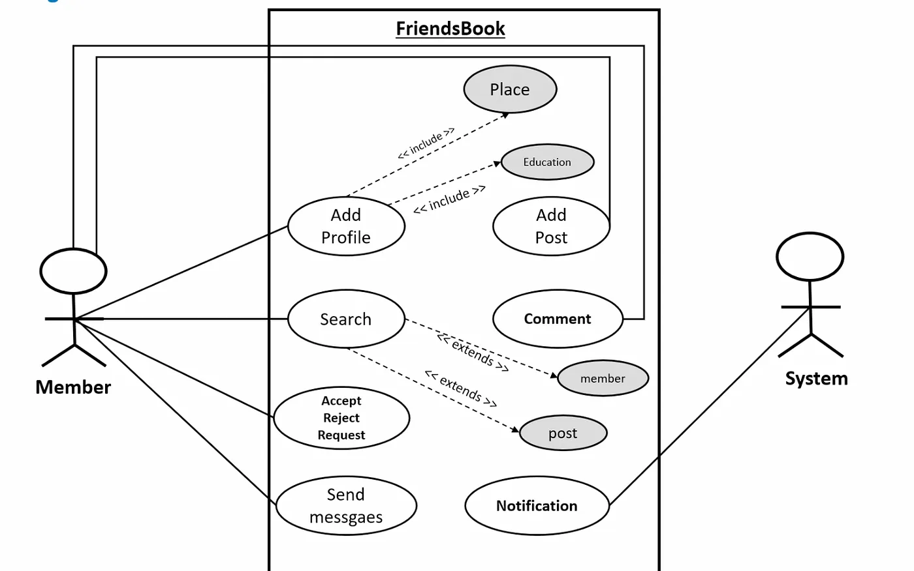

[Detailed](https://medium.com/@kumar.atul.2122/designing-facebook-low-level-design-using-ood-b7c3c976b86e)

**Step 1: Requirement & Assumptions**


**Step 2: Use-case diagram**



**Step 3: Class diagram**


Detailed class diagram


**Step 4: Create Skeleton code**
<BR>
A. Enumerations

```java
enum RequestStatus {
    PENDING, ACCEPTED, REJECTED
}

enum AccountStatus {
    ACTIVE, CLOSED, CANCELED, BLACKLISTED, DISABLED
}
```

B. Person & Address class

```java
class Address {
    public String street, city, state, zipcode, country;

    public Address(String street, String city, String state, String zipcode, String country) {
        this.street = street;
        this.city = city;
        this.state = state;
        this.zipcode = zipcode;
        this.country = country;
    }

}

class Person {
    public String name, email, phone;
    public Address address;

    public Person(String name, String email, String phone, Address address) {
        this.name = name;
        this.email = email;
        this.phone = phone;
        this.address = address;
    }

}
```

C. Member & System class

```java
class Account {

    public String id, password;
    public Person person;
    public AccountStatus status;

    public Account(String id, String password, Person person, AccountStatus status) {
        this.id = id;
        this.password = password;
        this.person = person;
        this.status = status;
    }

    public void resetPassword() {
        this.password = "";
    }
}

class Member extends Account {

    public int id;
    public ArrayList<Member> following, followers;
    public ArrayList<Page> pagesFollow;

    public Member(String id, String password, Person person, AccountStatus status, int id2) {
        super(id, password, person, status);
        this.id = id2;
        this.following = new ArrayList<Member>();
        this.followers = new ArrayList<Member>();
        this.pagesFollow = new ArrayList<Page>();
    }

    public void sendMessage(String msg) 
    {
       Message(messageId, text, media, sentTo, this);
    }

    public void creatPost(Post post) 
    {
       Post(this, id, text);
    }

    public void sendRequest(Member name) 
    {
       FriendRequest(this, name);
    }

}

class System extends Account {

    System(String id, String password, Person person, AccountStatus status) {
        super(id, password, person, status);
    }

    public void blockMember(Member name) 
    {
       name.status = DISABLED;
    }

    public void unblockMember(Member name) 
    {
       name.status = ACTIVE;
    }

}
```

D. Profile class

```java
class Profile {
    public String profilePic, coverPic, gender;
    public ArrayList<String> experiences;
    public String place;

    public Profile(String profilePic, String coverPic, String gender, String place) {
        this.profilePic = profilePic;
        this.coverPic = coverPic;
        this.gender = gender;
        this.place = place;
        this.experiences = new ArrayList<String>();
    }

}
```

E. FriendRequest class

```java
class FriendRequest {
    public Member requestFrom, requestTo;
    public RequestStatus status;
    public LocalDateTime created, updated;

    FriendRequest(Member user1, Member user2) {
        this.requestFrom = user1;
        this.requestTo = user2;
        this.created = LocalDateTime.now();
        this.status = RequestStatus.PENDING;
    }

    public void accept() 
    {
        this.status = RequestStatus.ACCEPTED;
        this.updated = LocalDateTime.now();
        this.requestFrom.following.add(requestTo) ;
        this.requestTo.followers.add(requestFrom) ;
    }

    public void reject() 
    {
        this.status = RequestStatus.REJECTED;
        this.updated = LocalDateTime.now();
    }

}
```

F. Page & Post class

```java
class Page {
    public String name, description, id;
    public ArrayList<Member> members;

    Page(String name, String description, String id) {
        this.name = name;
        this.description = description;
        this.id = id;
        members = new ArrayList<Member>();
    }

    public int getTotalMember() {
        return members.size();
    }

}

class Post {
    public Member owner;
    public String postId, text;
    public int totalLikes, totalShares;

    public Post(Member owner, String postId, String text) {
        this.owner = owner;
        this.postId = postId;
        this.text = text;
        this.totalLikes = 0;
        this.totalShares = 0;
    }

    public void addLike() {
        totalLikes++;
    }
}
```

G. Message & Comment class

```java
class Message {
    public String messageId, text, media;
    public Member sentTo, sentFrom;

    public Message(String messageId, String text, String media, Member sentTo, Member sentFrom) {
        this.messageId = messageId;
        this.text = text;
        this.media = media;
        this.sentTo = sentTo;
        this.sentFrom = sentFrom;
    }

    public String getText() {
        return text;
    }

    public String getMedia() {
        return media;
    }
}

class Comment {
    public String commentId, text;
    public int totalLikes;
    public Member owner;

    public Comment(String commentId, String text, Member owner) {
        this.commentId = commentId;
        this.text = text;
        this.owner = owner;
    }

    public void addLike() {
        totalLikes++;
    }
}
```

H. FriendsBook class

```java
class App 
{
    public static void main(String[] args) 
    {
         public void resetPassword(String password) 
           {
              this.password = password;
           }
    }
}
```